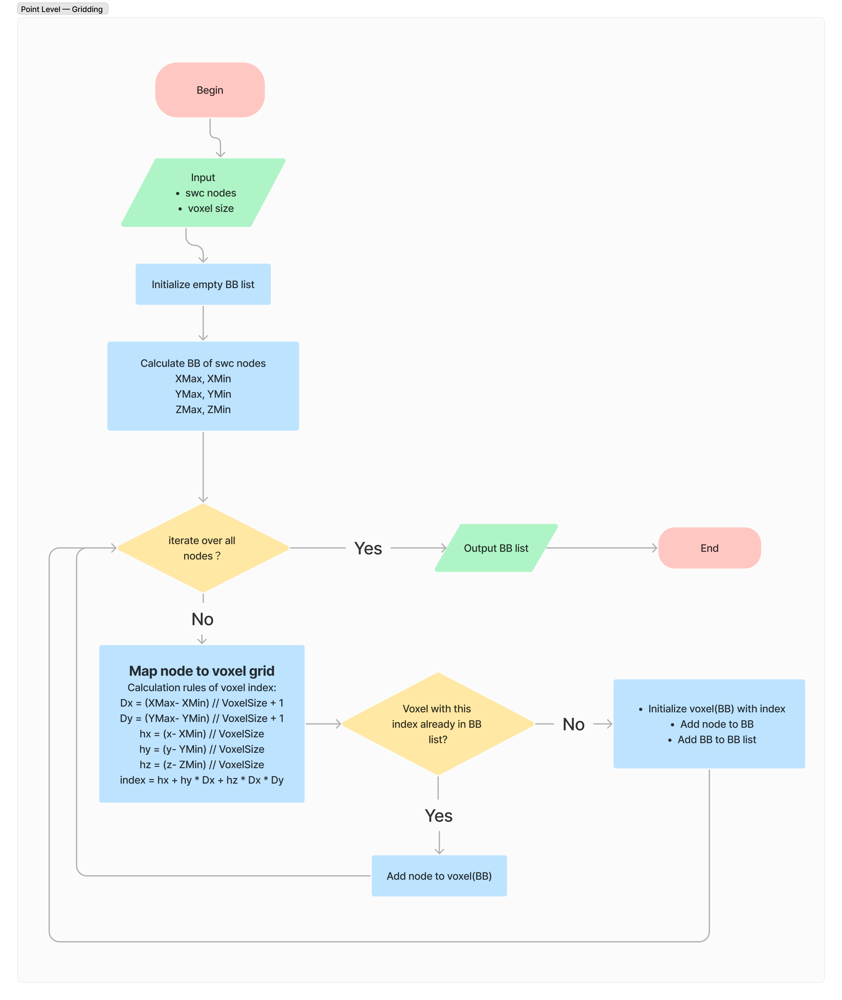
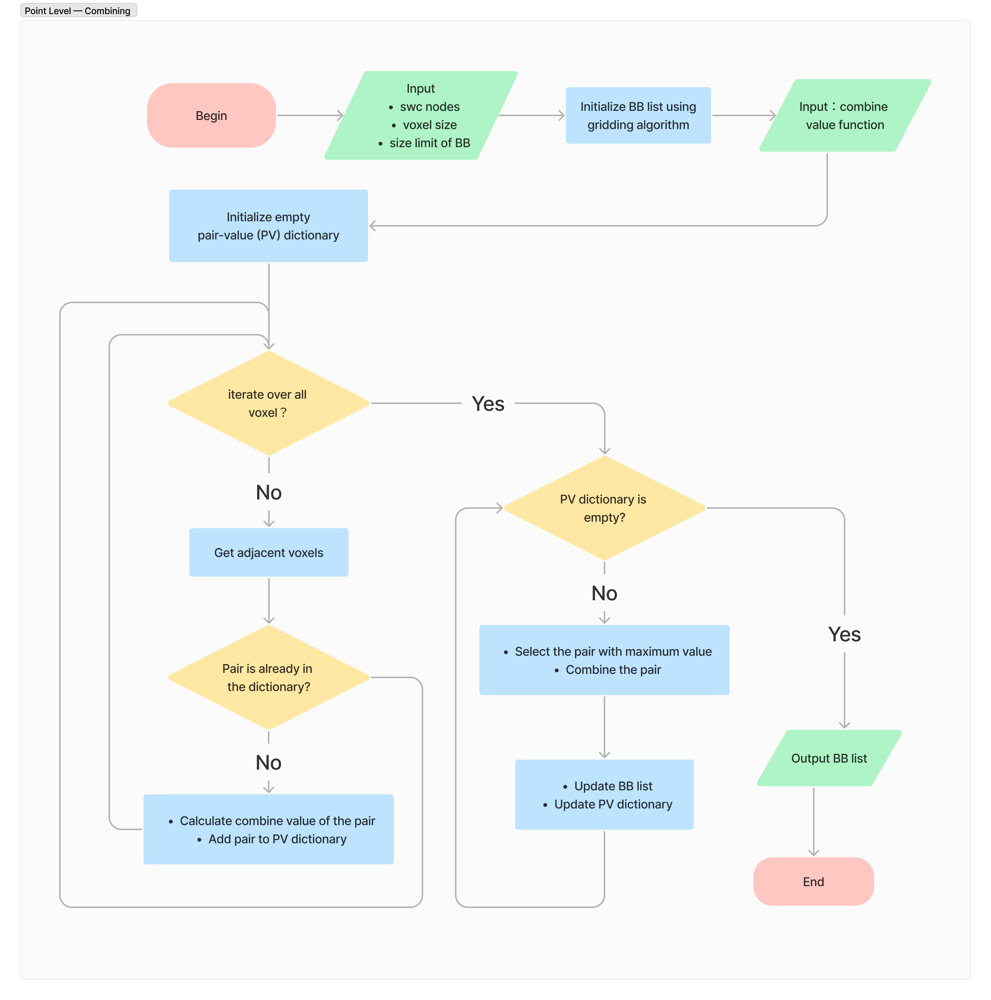

# NeuVOI:  A tool for the optimal extraction of the neuron’s volumes of interest from its whole-brain image dataset

---
## Introduction

This is a tool for efficient extraction of a neuron's Volumes of Interest from large-scale image datasets. 

- An example of extracting a VOI from whole-brain data for neuron reconstruction at a specific location.

- Comparison of the effects of different VOI extraction methods. The fixed-scale partition strategy uniformly divides the entire space using a predetermined partition size based on the bounding box of the neuron morphology data. It then retains only those partitioned blocks that contain neurites. Here, we provide two sets of sizes to demonstrate the partitioning effect of this strategy.

**This projected is started by Yuning Hang ([CoFuture](https://github.com/CoFuture)) and Shengdian Jiang ([SD-Jiang](https://github.com/SD-Jiang)) in 2022, Institute, Nanjing, China.**

## Tutorial

---

The neuronal volumes of interest extraction applications can be categorized depending on whether topological information is considered. Topologically irrelevant applications, such as sharing image volumes of individual neurons , neurite radius estimation , and image intensity extraction, treat SWC nodes of a neuron reconstruction as a set of independent points. While for tasks such as neuronal skeleton refinement, production of dendritic spines, and axonal boutons, image information of topologically connected or neighboring nodes of a processing node has to be considered before decision-making. NeuVOI serves as an application-oriented tool and implements two algorithms for different scenarios.

### Point-level algorithm
    For applications where topology of SWC nodes is unnecessary

The strategy of our algorithm is to firstly partition the entire SWC node space into smaller blocks, and then merge adjacent blocks while considering the following constraints: 
1) computer memory limitations; 
2) user-defined maximum block size; 
3) proportion of single voxel containing SWC nodes in the block. 

#### Applicable scene

- No need to consider the topological relationship between data units (E.g. swc nodes)
- Higher requirements for IO optimization\
E.g. L0 transmission performance optimization

#### Workflow
The algorithm is mainly divided into two steps
1. Voxel gridding, mapping the original data units (swc node) to a voxel grid with a spatial index
2. Calculate the combine value and iteratively combine the voxel grid

Here are two flowcharts of the algorithm

ps. The combined value calculation function is currently hard-coded. If you have a deep understanding of the source code, you can try to modify the `calCombineValue` function in `voxel_crop.py`. Subsequent updates will provide a custom interface for the value function.

#### Usage
1. Open config.py and configure the parameters in it
2. run voxel_crop.py with the command below
~~~python
python voxel_crop.py
~~~

Here is a detailed description of the parameters below.

| Parameter  | Description                                              | Range        | Default |
|------------|----------------------------------------------------------|--------------|---------|
| Input      | input file (.swc) path                                   | /            | /       |
| Output     | output file (.json) path                                 | /            | /       |
| voxel_size | The size of voxel grid in voxel gridding                 | unlimited    | 64      |
| max_size   | The maximum size of bounding box (BB) during combination | unlimited    | 512     |
| overlap    | Allow overlap between BBs when doing combination         | True / False | False   |

### segment-level algorithm
#### Overall effect

#### Applicable scene

- Need to consider the topological relationship between data units (E.g. swc nodes)
- Certain requirements for IO optimization\
E.g. Backtracking swc-specific morphological structures

#### Workflow
The algorithm is mainly divided into two steps
1. Divide swc into segments
2. For each segment, the bounding box growth algorithm (see BB growth algorithm in supplementary) is used for division.

Here is the flowchart of the algorithm

#### Usage
1. Open config.py and configure the parameters in it
2. run segment_crop.py with the command below
~~~python
python segment_crop.py
~~~

Here is a detailed description of the parameters below.

| Parameter    | Description                                         | Range     | Default |
|--------------|-----------------------------------------------------|-----------|---------|
| Input        | input file (.swc) path                              | /         | /       |
| Output       | output file (.json) path                            | /         | /       |
| max_bb_size  | The max size of bounding box when dividing segments | unlimited | 256     |
| padding_size | The padding size when finalizing bounding box       | unlimited | 64      |

### supplementary
#### Bounding box (BB) growth

Here is the flowchart of the algorithm

First, a bounding box is initialized by two nodes. As long as the BB size limit is not exceeded, a new node is added to the bounding box. If it exceeds, a new bounding box is re-initialized and the node is added to the new BB.Traverse all nodes until all nodes of the segment are divided.

## Acknowledgements

---

Thanks to the guidance of Yufeng Liu and Hanchuan Peng

## License

---
